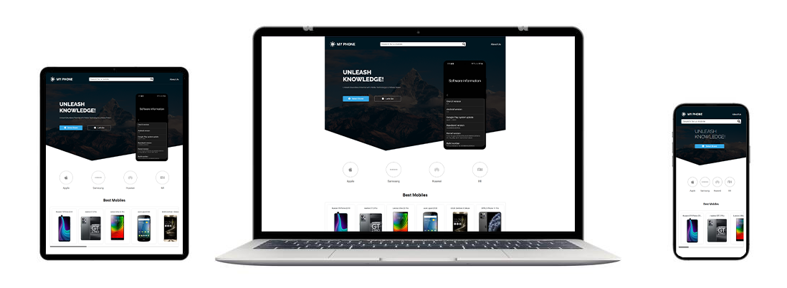

# MY PHONE _V3_



Welcome to MY PHONE, where you can dive into a comprehensive database of mobile phones. Our website is built using a dynamic combination of React and Flask on the server, complemented by the robust MongoDB as our backend database. Whether you're seeking detailed specifications, vibrant images, or the latest models, MY PHONE offers an interactive and seamless exploration of the mobile world.

_To try the website [Click Hear](https://my-phone-frontend.onrender.com)_

---

## Features

1. **Search Functionality:**
   Easily search for a specific mobile phone using the search bar. The website supports efficient searching through a vast database of mobile phones, making it convenient for users to find the information they need.

2. **Browse by Brand:**
   Select a specific brand from the available options to view a list of mobile phones associated with that brand. This feature allows users to explore a curated collection of mobile devices from their preferred manufacturers.

3. **Detailed Mobile Phone Pages:**
   Each mobile phone has its dedicated page, showcasing detailed information such as specifications, images, and other relevant details. Users can immerse themselves in a comprehensive overview of their desired mobile devices.

4. **Responsive Design:**
   The website is designed using CSS to ensure a responsive and visually appealing user interface. Whether accessed on a desktop, tablet, or mobile device, the layout adjusts seamlessly to provide an optimal viewing experience.

---

## Tech Stack

### Frontend


- **React:** A powerful JavaScript library for building user interfaces.
- **React Router DOM:** Client side routing.
- **React Dotenv:** Read the environment variables.

### Backend


- **Flask:** A lightweight and efficient web framework for Python.
- **Decouple:** SStore parameters in INI or .env files.
- **PyMongo:** A Python distribution containing tools for working with MongoDB.
- **Flask cors:** A Flask extension for handling Cross Origin Resource Sharing (CORS).

### Database


- **MongoDB:** A flexible and scalable database solution, providing a robust storage platform for mobile phone data.

---

## Getting Started

To run the project locally, follow these steps:

### 1- Clone the repository

```bash
git clone https://github.com/Ashraf-Alshashaa/My-Phone.git
```

### 2- Navigate to the backend folder in the project directory

```bash
cd \My-Phone\backend
```

### 3- Create an `.env` file and create the following variables in it

```bash
MONGO_URI="Write your database URI"
MONGO_DB_NAME="Write your database name"
```

### 4- Install the server dependencies

```bash
pip install -r requirements.txt
```

### 5- Navigate to the frontend folder in the project directory

```bash
cd \My-Phone\frontend
```

### 6- Create an `.env` file and create the following variables in it

```text
REACT_APP_BASE_SERVER_URL="Write the server's URL that it is running on"
```

### 7- Install frontend dependencies

```bash
npm install
```

### 8- Start the development servers

- Navigate to the backend folder and run:

```bash
python run.py
```

- Navigate to the frontend folder and run:

```bash
 npm start
```

- Open your browser and visit `http://localhost:3000` to view the website.

---

## project structure

```text
_________ My-Pone
    |
    |______ backend
    |   |
    |   |____ app
    |   |  |____ __init__.py
    |   |  |____ controllers.py
    |   |  |____ routes.py
    |   |
    |   |____ .env
    |   |____ requirements.txt
    |   |____ run.py
    |
    |______ frontend
    |   |
    |   |______ public
    |   |   |
    |   |   |____ images
    |   |   |   |____ view-website.png
    |   |   |
    |   |   |____ favicon.ico
    |   |   |____ index.html
    |   |   |____ manifest.json
    |   |   |____ robots.txt
    |   |
    |   |______ src
    |   |   |
    |   |   |____ components
    |   |   |   |
    |   |   |   |____ BrandsSelector
    |   |   |   |   |____ index.jsx
    |   |   |   |   |____ style.css
    |   |   |   |
    |   |   |   |____ Header
    |   |   |   |   |____ index.jsx
    |   |   |   |   |____ style.css
    |   |   |   |
    |   |   |   |____ Hero
    |   |   |   |   |____ index.jsx
    |   |   |   |   |____ style.css
    |   |   |   |
    |   |   |   |____ Img
    |   |   |       |____ index.jsx
    |   |   |
    |   |   |____ hooks
    |   |   |   |____ extract-name-info.js
    |   |   |   |____ useFetch.js
    |   |   |
    |   |   |____pages
    |   |   |   |
    |   |   |   |____ about-us
    |   |   |   |   |____ index.jsx
    |   |   |   |   |____ style.css
    |   |   |   |
    |   |   |   |____ brand
    |   |   |   |   |____ index.jsx
    |   |   |   |   |____ style.css
    |   |   |   |
    |   |   |   |____ Home
    |   |   |   |   |
    |   |   |   |   |____ icons
    |   |   |   |   |   |____ Apple.png
    |   |   |   |   |   |____ Huawei.png
    |   |   |   |   |   |____ Samsung.png
    |   |   |   |   |   |____ Xiaomi.png
    |   |   |   |   |
    |   |   |   |   |____ index.jsx
    |   |   |   |   |____ style.css
    |   |   |   |
    |   |   |   |____ loading
    |   |   |   |   |____ index.jsx
    |   |   |   |   |____ style.css
    |   |   |   |
    |   |   |   |____ mobile
    |   |   |   |   |____ index.jsx
    |   |   |   |   |____ style.css
    |   |   |
    |   |   |____App.css
    |   |   |____App.js
    |   |   |____index.js
    |   |
    |   |____ .env
    |   |____ .gitignore
    |   |____ package-lock.json
    |   |____ package.json
    |
    |____ Readme.md

```

---

## Contributors

### Ashraf Alshashaa

[](https://github.com/Ashraf-Alshashaa)
[](https://www.linkedin.com/in/ashraf-alshashaa/)

---

## Feedback and Issues

If you encounter any issues or have suggestions for improvement, please feel free to open an issue. Your feedback is highly appreciated!

### `Happy exploring MY PHONE on our website!`
