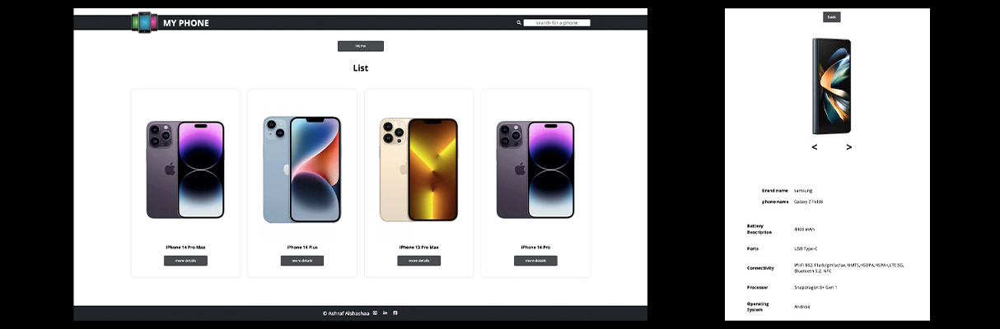

# My Phone

#### _beta v2_

## Full description

full stack app you can look through it at phones details


---


## there will be

### 1- Home page

> _it will contain_

- a selector element for phone brands
- button to move us to the list of Apple brand phones
- button to move us to the list of Samsung brand phones

### 2- Phones list page

> _it will contain_

- list of phones cards of a brand, each card has an image, phone name, and button to move us to the details page of the selected phone
- back button to home page

### 3- details page

> _it will contain_

- img of the selected phone
- summary of most important details
- the rest of the details
- back button to home page

### 4- search box of phones

- return lest of phones names, each one moves us to the selected phone details

###### note : search box doesn't work, we're working on fixing it right now

### Images form the application



---

## Get start

### repository setup

1. clone the repo
2. Run `npm run dev`

### create database and insert

1. write your database url in index file in db folder
2. Run `node index.js` inside db file

### start the applecation

1. write your database url in controller file in controller folder
2. run `npm start` or `node server.js`
3. Open http://localhost:3000 in the browser

### project structure

```
_________
        |______public
        |   |
        |   |____images
        |   |____style.css
        |
        |______server
        |   |
        |   |____controller
        |   |   |____controller.js
        |   |
        |   |____db
        |   |   |____index.js
        |   |   |____data.js
        |   |
        |   |____routes
        |   |   |____my-phone.js
        |   |
        |   |____app.js
        |   |____package-lock.json
        |   |____server.js
        |
        |______src
        |   |
        |   |____components
        |   |   |____searchBox.js
        |   |
        |   |____helpers
        |   |   |____fetch.js
        |   |
        |   |____pages
        |   |   |____buttonsPage.js
        |   |   |____cardPage.js
        |   |   |____detailsPage.js
        |   |   |____homePage.js
        |   |   |____phonesListPage.js
        |   |   |____selectBrandPage.js
        |   |
        |   |____views
        |   |   |____buttonsView.js
        |   |   |____cardView.js
        |   |   |____detailsView.js
        |   |   |____homeView.js
        |   |   |____phonesListView.js
        |   |   |____selectBrandView.js
        |   |   |____errorHandling.js
        |   |
        |   |____app.js
        |   |____constant.js
        |
        |____index.html
        |____Readme.md
```

## javascript code description

ES7

- Arrow Functions
- Block-Scope Variables
- async await
- Modules export/import
- New Built-In Methods

## Frameworks

| Framework | Version |
| --------- | ------- |
| express   | ^4.18.1 |
| mongodb   | ^4.10.0 |
| path      | ^0.12.7 |

#### MUST-TO-HAVE

- [x] Create the project structure
- [x] Create Readme file
- [x] Create welcome page
- [x] Create a page to view the list of phone
- [x] Create phones cards
- [x] Create details phone page
- [x] Create brands selector
- [x] Create search box
- [x] Create a button to back to the home page
- [x] Handling errors
- [x] style
- [x] Prepare the repository

#### NICE-TO-HAVE

- [x] add photos slider to details page
- [x] add phone photo to search phones list
- [x] back button
- [ ] A user can refresh the page and still have the current page
