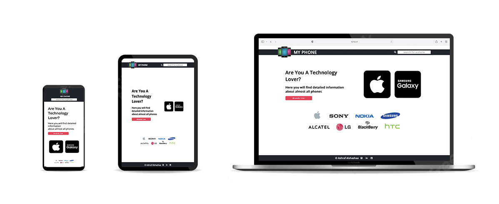

# Full description

The app will be a website can you look through it at the details of almost all phones in this world

---



> You can try using the application [Here](https://ashraf-alshashaa.github.io/API-Project/)

## there will be

### 1- Home page

> _it will contain_

- a selector element for phone brands
- button to move us to the list of Apple brand phones
- button to move us to the list of Samsung brand phones

### 2- Phones list page

> _it will contain_

- list of phones cards of a brand, each card has an image, phone name, and button to move us to the details page of the selected phone
- back button to home page

### 3- details page

> _it will contain_

- img of the selected phone
- summary of most important details
- the rest of the details
- back button to home page

### 4- search bar of phones

- return lest of phones names, each one moves us to the selected phone details

---

### project structure

```
_________
        |______public
        |   |____images
        |   |____style.css
        |
        |______src
        |   |
        |   |____components
        |   |   |____searchBox.js
        |   |
        |   |____helpers
        |   |   |____errorHandling.js
        |   |   |____fetch.js
        |   |
        |   |____pages
        |   |   |____buttonsPage.js
        |   |   |____cardPage.js
        |   |   |____detailsPage.js
        |   |   |____homePage.js
        |   |   |____phonesListPage.js
        |   |   |____selectBrandPage.js
        |   |
        |   |____views
        |   |   |____buttonsView.js
        |   |   |____cardView.js
        |   |   |____detailsView.js
        |   |   |____homeView.js
        |   |   |____phonesListView.js
        |   |   |____selectBrandView.js
        |   |
        |   |____app.js
        |   |____constant.js
        |
        |____index.html
        |____Readme.md
```

#### MUST-TO-HAVE

- [x] Create the project structure
- [x] Create Readme file
- [x] Create welcome page
- [x] Create a page to view the list of phone
- [x] Create phones cards
- [x] Create details phone page
- [x] Create brands selector
- [x] Create search box
- [x] Create a button to back to the home page
- [x] Handling errors
- [x] style
- [x] Prepare the repository

#### NICE-TO-HAVE

- [x] add photos slider to details page
- [x] add phone photo to search phones list
- [ ] back button
- [ ] A user can refresh the page and still have the current page
